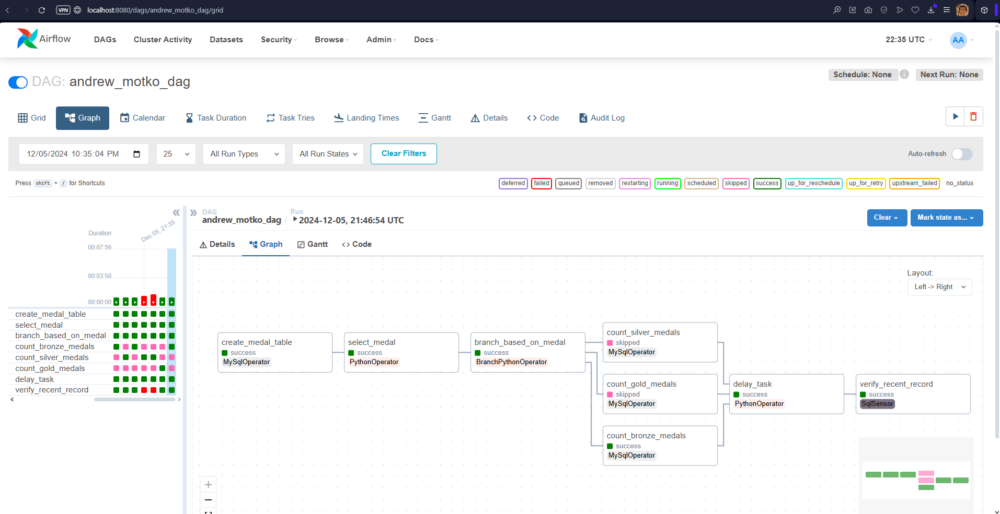
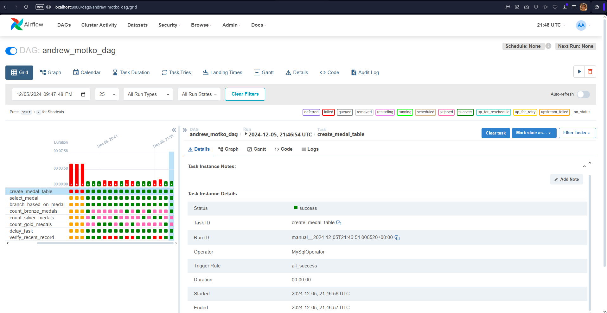
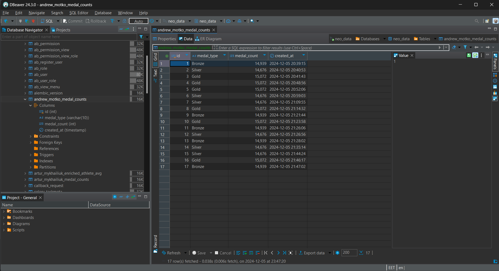

# Solution

## DAG Structure: Task Execution Graph

## Run results: Log and DAG execution statuses.

## Screenshots from the MySQL table: With recorded results.

# Description

## DAG execution results

- **DAG name:** andrew_motko_dag
- **Total Runs Displayed:** 25
- **Total success:** 9
- **Total failed:** 16
- **First Run Start** 2024-12-05, 19:26:54 UTC
- **Last Run Start** 2024-12-05, 21:46:54 UTC
- **Max Run Duration** 00:07:56
- **Mean Run Duration** 00:03:03
- **Min Run Duration** 00:00:28

## DAG Components Overview

1. **Number of Tasks:** 8

- **Operators:**

  - MySqlOperator: 4
  - PythonOperator: 2
  - BranchPythonOperator: 1
  - SqlSensor: 1

2. **Task Relationships:**

- The DAG starts by creating a table in MySQL.
- After table creation, a random medal type is selected (Gold, Silver, or Bronze).
- The choice of medal type determines which branch of execution will run.
- After counting the medals, a 20-second delay simulates processing, followed by a sensor task checking if a recent record exists in the table (created within the last 30 seconds).

## Implemented Steps

### 1. Table Creation

- MySqlOperator is used to create a table andrew_motko_medal_counts in the neo_data schema with the following columns:
  - `id`: auto-incremented, PRIMARY KEY
  - `medal_type`: the type of medal (Gold, Silver, Bronze)
  - `medal_count`: the count of medals of each type
  - `created_at`: timestamp of when the record was created (default to current time)

### 2. Random Medal Selection

- A PythonOperator executes the function random_medal_choice that randomly selects one of three medal types: "Gold", "Silver", or "Bronze". This value is passed to the next tasks via XCom.

### 3. DAG Branching

- BranchPythonOperator determines which branch to take based on the randomly selected medal type:

  - If "Gold" is selected, the "count_gold_medals" task will run.
  - If "Silver" is selected, the "count_silver_medals" task will run.
  - If "Bronze" is selected, the "count_bronze_medals" task will run.

### 4. Counting Medals

MySqlOperator tasks for each medal type execute the corresponding SQL queries to count the number of occurrences of each medal in the `athlete_event_results` table from the `olympic_dataset` schema:

- "Gold" medals are counted using a SQL query that filters for the "Gold" medal.
- "Silver" medals are counted using a SQL query that filters for the "Silver" medal.
- "Bronze" medals are counted using a SQL query that filters for the "Bronze" medal.
- The results of these counts are inserted into the andrew_motko_medal_counts table.

### 5. Execution Delay

- A **PythonOperator** task simulates a delay by executing the `delay_execution` function, which uses `time.sleep(20)` to pause the DAG execution for 20 seconds. This simulates a complex processing delay in the pipeline.

### 6. Check for Recent Record

- **SqlSensor** checks whether any records exist in the andrew_motko_medal_counts table that were created within the last 30 seconds. This task uses a SQL query to count recent entries and returns a boolean value. If no recent records are found within the specified timeout of 30 seconds, the task will fail.

## Task Flow

### 1. Task Chain

- The `create_table_task` runs first to create the necessary table.
- Then, the `select_medal_task` executes to randomly pick a medal type.
- ased on the selected medal, the `branching_task` decides which medal counting task to run.
- The counting tasks for "Gold", "Silver", and "Bronze" will execute depending on the branching logic.
- After counting the medals, the `delay_task` is triggered (it only runs if at least one of the medal counting tasks succeeded).
- Finally, the `check_last_record_task` ensures that a recent record exists in the table, confirming that the data processing was successful.

## Key Considerations

- **Error Handling and Retries:**

  - The DAG has a retry mechanism defined in `default_args` with a maximum of one retry for each task.

- **XCom Usage:**

  - The select_medal_task uses XCom to pass the selected medal type to the branching logic, which dynamically determines which task to execute next.

- **Trigger Rule:**

  - The `delay_task` has a `TriggerRule.ONE_SUCCESS` trigger rule, meaning it will run if at least one of the medal counting tasks succeeds, regardless of which specific task ran.

- **Sensor Mode:**
  - The `SqlSensor` is set to "poke" mode, where it repeatedly checks for a condition every 10 seconds, with a total timeout of 30 seconds. If no recent record is found, the task will fail.

This DAG implements an automated workflow for processing Olympic medal data and ensures that only valid records are inserted into the database, with a delay and verification mechanism to ensure data
